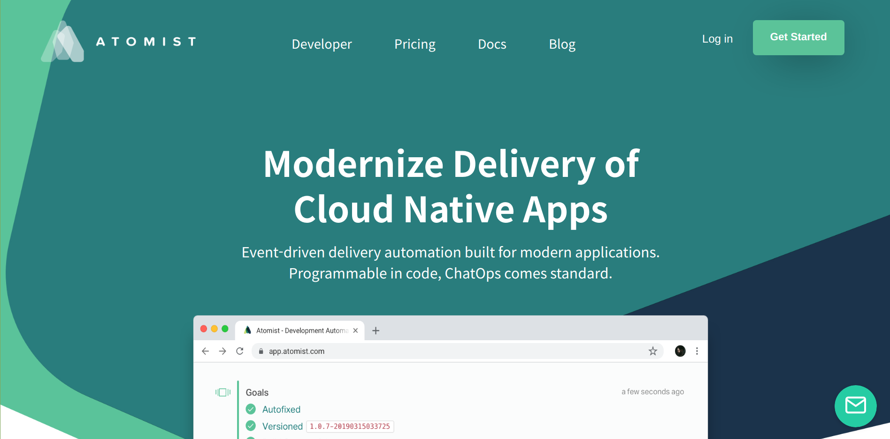

# Atomist Landing Page Clone Project
### Created for Chingu Voyage 9 (Tier 1)
 #### Team name : v9-toucans-team-16
 
 Github Pages Link: https://chingu-voyages.github.io/v9-toucans-team-16/
 Original Atomist Website Link: https://atomist.com/
 
### About
This landing page clone was created for Chingu Voyage 9.

#### Team members:
- @josephk96 https://github.com/josephk96
- @c0d3ph1l1c https://github.com/c0d3ph1l1c

### Objectives
- Learn how to collaborate as a group (Before starting this project, none of the group members had team coding experience).
- Get familiar with using Git&Github.
- Incorporate SCSS into a project.

### MVP (Minimum Viable Product)
- Fully responsive, mobile-first landing page.

## Tech Stack
- HTML
- CSS + SCSS
- JavaScript

## Acknowledgements
Big thanks to all the moderators and organizers of Chingu!
- Chingu Website: https://chingu.io/
- Chingu Github: https://chingu-cohorts.github.io/chingu-directory/  
- Chingu Medium page: https://medium.com/chingu

| Voyage-9 | 

